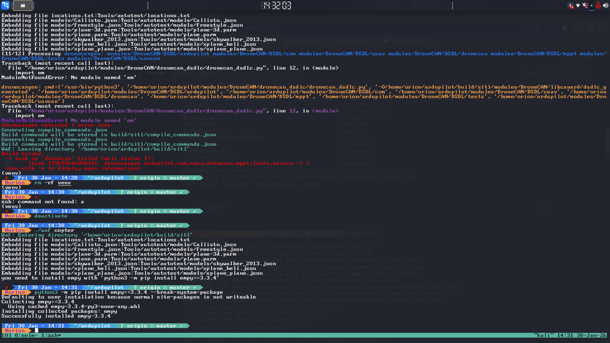
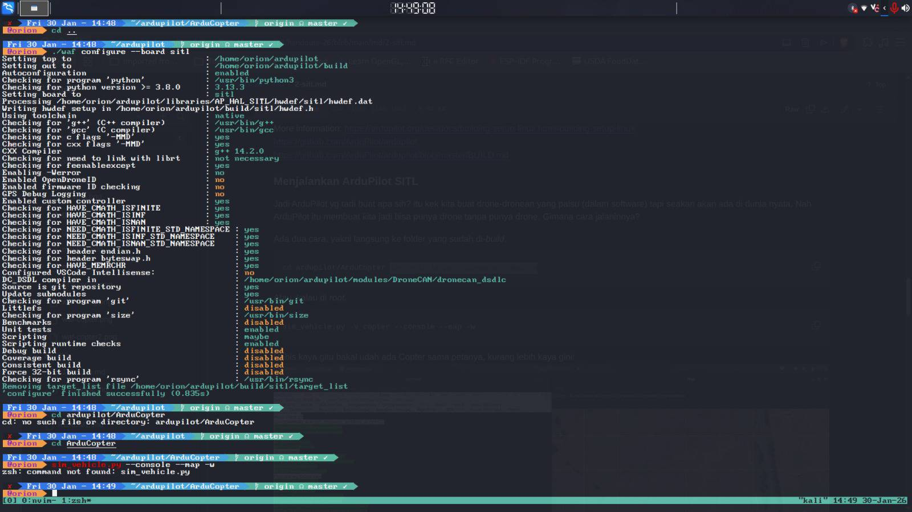
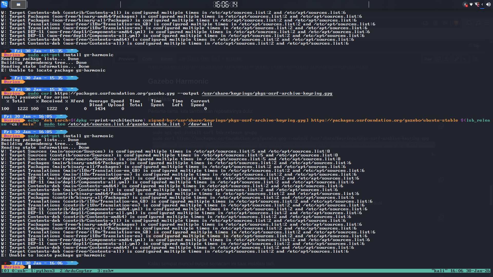

# Technical-Journal
Dzaky Hadyan Eliyanta
### Dasar Pemrograman
- Pada materi ini, saya memiliki pemahaman yang bisa dibilang cukup mengenai OOP karena saya memiliki pengalaman mempelajari bahasa _java_, namun terdapat beberapa topik yang belum saya pahami terkhusus yang memang adanya di bahasa C++ seperti _pointer_, konsep RAII, _virtual function_, dan lain sebagainya, sehingga saya perlu untuk mendalami lebih konsep-konsep asing dari bahasa C++ ini melalui media seperti website pembelajaran pemrograman seperti https://www.geeksforgeeks.org, dokumentasi _official_ C++, YouTube, termasuk menggunakan AI untuk menjelaskan kembali ke saya konsep-konsep tersebut menggunakan bahasa yang lebih mudah dipahami  
- Saya menyadari bahwa banyak sekali hal yang belum saya pahami pada Dasar Pemrograman, dibuktikan dari betapa tidak berdayanya saya di hadapan Hands-On 1 meskipun sudah mempelajari Handout, referensi yang diberikan, serta memanfaatkan AI untuk mengajari saya  
### Hands-On 2
- Pada saat mengerjakan _assignment_ Hands-On 2, saya mengalami beberapa kesulitan dan banyak menghabiskan waktu pada instalasi, seperti pada di bawah ini  
  
Screenshot di atas adalah saat saya gagal melakukan _build_ Ardupilot karena OS saya, yaitu Kali Linux, melarang untuk meng-install dependencies tersebut _system-wide_ karena dapat merusak OS, namun bisa saya akali dengan menggunakan flag `--break-system-package`.  
- Kendala selanjutnya adalah tidak terdapat _script_ sim_vehicle.py untuk dijalankan meskipun sudah melakukan build `./waf configure` dan `./waf copter` seperti pada di bawah ini  
  
namun dapat diatasi dengan menambahkan `export PATH=$PATH:/home/orion/ardupilot/Tools/autotest` di baris akhir ~/zhsrc dan melakukan `source ~/zhsrc` dari asistensi kepada Kak Nayaka  
- Kendala berikutnya adalah copter dan camera yang tidak muncul meskipun sudah berhasil menjalankan sim_vehicle.py, yang ternyata diakibatkan oleh belum ter-install-nya _MAVProxy_. Ternyata dapat teratasi hanya dengan meng-install-nya menggunakan `pip install`  
- Kendala berikutnya adalah tidak dapat meng-install gz-harmonic atau gazebo seperti di bawah ini  
  
Hal tersebut terjadi karena gazebo merupakan tools milik ubuntu sedangkan distro linux saya adalah Kali Linux. Saya dapat mengatasi masalah tersebut dengan menggunakan docker image dari ROS karena ROS kompatibel dengan gazebo
